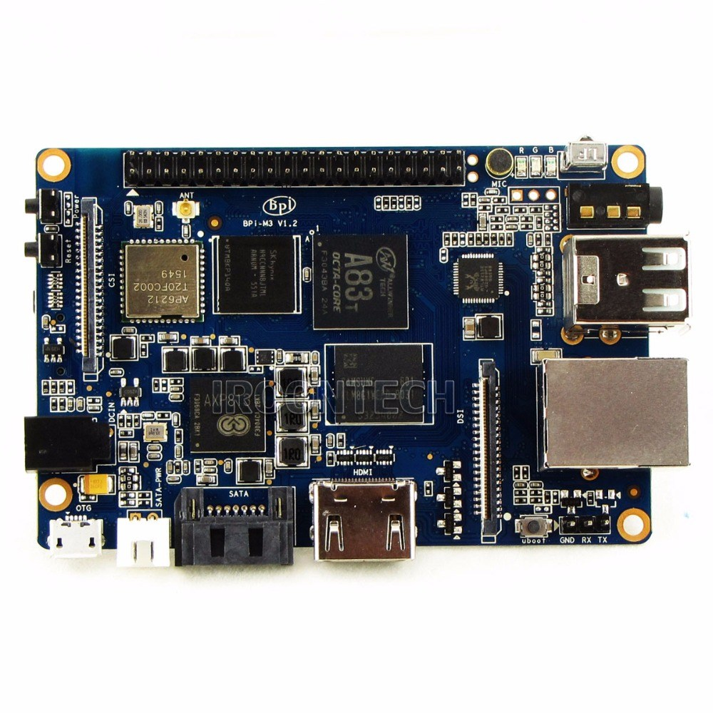

---
title:
- Въведение в програмирането с Python
author:
- Евгени Пандурски
theme:
- Copenhagen
---

# За какво е този курс?

1. Въведение
2. Програмиране
3. Python

# Въведение

# Какво е програмиране?
{height=55%}\

Проблем: Управлението на сложни процеси е трудна и отговорна работа.

# Какво е програмиране?
{height=60%}\

Решение: Програмирането е автоматизирано управление на процеси.

# Какво е програма?

{height=60%}

# Как работи компютърът?
{height=60%}

# Как работи компютърът?
{height=55%}

# Как работи компютърът?
{height=60%}

# Как работи компютърът?
{height=60%}

# Какво е компютърна програма?

* Компютърната програма е много подробна рецепта за процесора -- как
  да "мести" числа от едно място в паметта на друго.

* Всички периферни устройства (графична карта, монитор, USB контролер,
  принтер, дисков контролер, диск, мрежова карта и т.н.) четат от I/O
  паметта си какво процесорът им е казал да правят, и го правят.

# Какво е компютърна програма?

* Паметта е единственият "свят" който процесорът вижда. В паметта се
  съхраняват данни и програми. За да "види" нещо процесорът, трябва да
  го заредите в паметта му.

* За да изпълни процесорът дадена програма, трябва да я заредите в
  паметта му и да му наредите да започне да я изпълнява.

# Какво е компютърна програма?

{height=60%}

# Какво е компютърна програма?

Проблем:

* За да може процесорът да изпълни каквато и да било програма, тя
  трябва да бъде заредена в паметта като последователност нули и
  единици (двоичен код).

* За хората двоичният код е неразбираем.

# Какво е компютърна програма?

Решение:

* Програмистите могат да пишат програмите си на езици които са
  по-разбираеми за хората, след което тези програми се превеждат в
  двоичен код.
  
* Преводът се извършва от специализирани, много сложни програми,
  наречени "транслатори", "компилатори" или "интерпретатори".

# Какво е компютърна програма?

{height=60%}

# Какво е компютърна програма?

{height=60%}

# Какво е компютърна програма?

{height=60%}

# Python

Python е много популярен, съвременен, интерпретируем, интерактивен,
обектно-ориентиран език за програмиране.

* Създаден е от Гуидо ван Росум през 1990 г. Името си дължи на шоуто
  "Monty Python's Flying Circus", на което авторът на езика е
  почитател.
* Версия 2.0 излиза през 2000 г. Финалната версия на "Python 2" е 2.7.
* Версия 3.0 излиза през 2009 г.

Други популярни интерпретируеми (скриптови) езици:

* Javascript
* Ruby
* Shell scripts (bash, PowerShell)

# Python

## Предимства:

* лесен за научаване
* популярен
* програмите често са по-къси и по-разбираеми
* работи на всякакви компютри и операционни системи
* open source
* огромно количество свободни за ползване библиотеки
* голямо "community" от много високо квалифицирани програмисти, които
  са готови да ви помогнат

## Недостатъци:

* недостатъчно "бърз" за някои видове приложения

# Python

## Къде бихте го ползвали:

* web сървъри
* графичен потребителски интерфейс (GUI)
* числено и статистическо програмиране
* machine learning
* shell скриптове
* игри
* компютърно обучение
* програмиране за удоволствие

## Къде не бихте го ползвали:

* писане на ядро на операциона система
* микроконтролери с много малко оперативна памет

# Python

1. epandurski@gmail.com

2. <https://python.org/>

3. <https://github.com/epandurski/python-course>

    * tutorial.pdf 
    * tutorial_BG_2.0.pdf
