---
title:
- Въведение в програмирането с Python
author:
- Евгени Пандурски (<epandurski@gmail.com>)
theme:
- Copenhagen
---

# За какво е този курс?

1. Въведение
2. Програмиране
3. Python

# Въведение


# Какво е програмиране?
{height=45%}\

Проблем: Управлението на сложни процеси е трудна и отговорна работа.

* изчислителни процеси
* бизнес процеси
* производствени процеси

# Какво е програмиране?
{height=60%}\

Решение: Програмирането е автоматизирано управление на процеси.

# Какво е програма?

{height=60%}

# Какво е програма?
{height=30%}\

Компютърът "се държи" като много ограничен човек, който може да прави
само пет неща:

* може безпогрешно да следва инструкци
* може да смята бързо
* може да помни много
* може да говори бързо
* може да ви разбере дори и да му говорите много бързо

но иначе, не може дори да си обърше носа!

# Как работи компютърът?
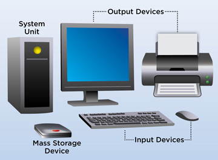{height=60%}

# Как работи компютърът?
{height=55%}

# Как работи компютърът?
{height=60%}

# Как работи компютърът?
{height=55%}

# Какво е компютърна програма?

* Компютърната програма е много подробна рецепта за процесора -- как
  да "мести" числа от едно място в паметта на друго.

* Всички периферни устройства (графична карта, монитор, USB контролер,
  принтер, дисков контролер, диск, мрежова карта и т.н.) четат от I/O
  паметта си какво процесорът им е казал да правят, и го правят.

* Паметта е единственият "свят" който процесорът вижда. В паметта се
  съхраняват данни и програми. За да "види" нещо процесорът, трябва да
  го заредите в паметта му.

* За да изпълни процесорът дадена програма, трябва да я заредите в
  паметта му и да му наредите да започне да я изпълнява.

# Какво е компютърна програма?

{height=60%}

# Какво е компютърна програма?

Проблем:

* За да може процесорът да изпълни каквато и да било програма, тя
  трябва да бъде заредена в паметта като последователност нули и
  единици (двоичен код).

* За хората двоичният код е неразбираем.

# Какво е компютърна програма?

Решение:

* Програмистите могат да пишат програмите си на езици които са
  по-разбираеми за хората, след което тези програми се превеждат в
  двоичен код.
  
* Преводът се извършва от специализирани, много сложни програми,
  наречени "транслатори", "компилатори" или "интерпретатори".

# Какво е компютърна програма?

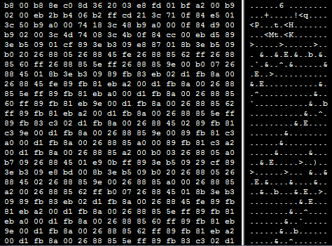{height=60%}

# Какво е компютърна програма?

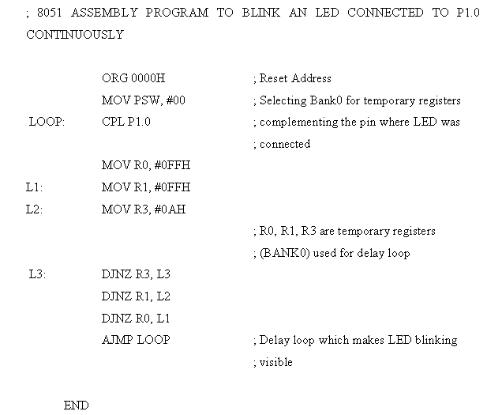{height=60%}

# Какво е компютърна програма?

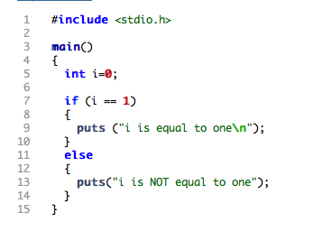{height=60%}

# Python

Python е много популярен, съвременен, интерпретируем, интерактивен,
обектно-ориентиран език за програмиране.

* Създаден е от Гуидо ван Росум през 1990 г. Името си дължи на шоуто
  "Monty Python's Flying Circus", на което авторът на езика е
  почитател.
* Версия 2.0 излиза през 2000 г. Финалната версия на "Python 2" е 2.7.
* Версия 3.0 излиза през 2009 г.

Други популярни интерпретируеми (скриптови) езици:

* Javascript
* Ruby
* Shell scripts (bash, PowerShell)

# Python

## Предимства:

* лесен за научаване
* популярен
* програмите често са по-къси и по-разбираеми
* работи на всякакви компютри и операционни системи
* open source
* огромно количество свободни за ползване библиотеки
* голямо "community" от много високо квалифицирани програмисти, които
  са готови да ви помогнат

## Недостатъци:

* недостатъчно "бърз" за някои видове приложения

# Python

## Къде бихте го ползвали:

* web сървъри
* графичен потребителски интерфейс (GUI)
* числено и статистическо програмиране
* machine learning
* shell скриптове
* игри
* компютърно обучение
* програмиране за удоволствие

## Къде не бихте го ползвали:

* писане на ядро на операциона система
* микроконтролери с много малко оперативна памет

# Python

1. epandurski@gmail.com

2. <https://python.org/>

3. <http://thonny.org/>

4. <https://github.com/epandurski/python-course>

    * exercises.pdf
    * tutorial.pdf 
    * tutorial_BG_2.0.pdf


# Какво трябва да знаем за операционните системи?

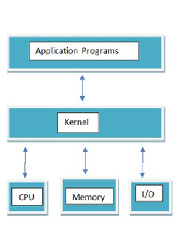{height=50%}


# Какво трябва да знаем за операционните системи?

{height=50%}


# Какво трябва да знаем за операционните системи?

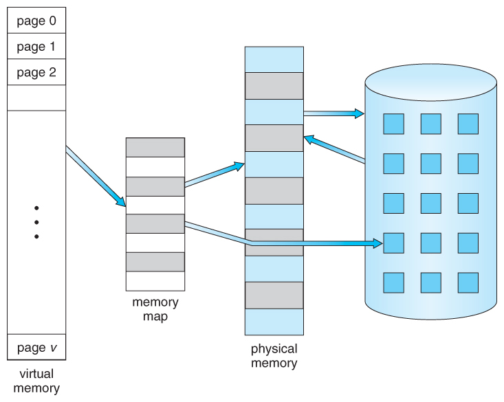{height=50%}


# Какво трябва да знаем за операционните системи?

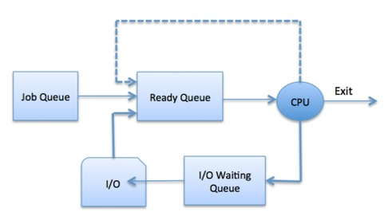{height=50%}


# Какво трябва да знаем за операционните системи?

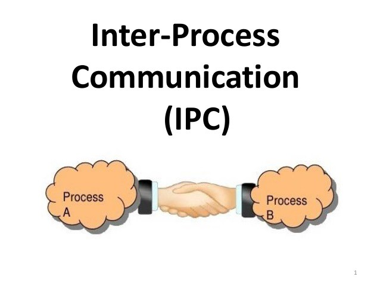{height=50%}


# Какво трябва да знаем за операционните системи?

{height=50%}


# Какво трябва да знаем за операционните системи?

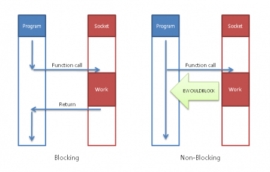{height=50%}


# PyGame

* Библиотека за писане на 2D игри на Питон

* <http://www.pygame.org/>

* Използва библиотеката SDL <http://www.libsdl.org/>

* Hardware Accelerated Graphics

    - framebuffer
    - drawing, "bit blit"

* Graphical User Interface (GUI)

    - windowing system
    - compositing
    - spirtes
    - event loop

* Примери

    - pdb
    - pudb


# Мрежови протоколи

{height=50%}


# Мрежови протоколи

{height=50%}


# Мрежови протоколи

{height=50%}


# Мрежови протоколи

{height=50%}


# Мрежови протоколи

{height=50%}


# Мрежови протоколи

TCP ни гарантира:

1. че това което изпращаме, ако бъде прието, ще бъде прието без
   грешки, в реда в който сме го изпратили;

2. че изпращащият компютър няма да подава информацията по-бързо
   отколкото приемащият компютър може да я обработва.

3. Можем да отвяряме много конекции към/от един и същ IP
   адрес. Различните конекции имат различен "порт".


# Мрежови протоколи

В Питон, стандарният модул `socket` ни позволява да отваряме и
затваряме TCP и UDP конекции, както и да изпращаме и получаваме
инфорамция по тях.

* Труден за ползване.
* Формата в който се изпращат и получават съобщенията е отговорност на
  програмиста.
* Криптирането е отговорност на прогамиста.


# Мрежови протоколи

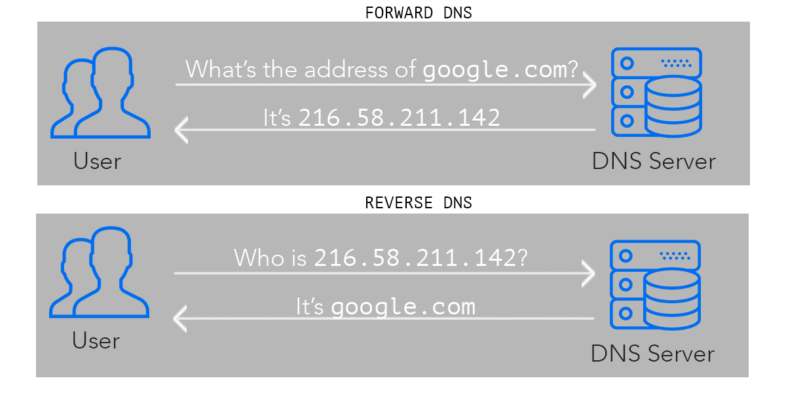{height=50%}


# Мрежови протоколи

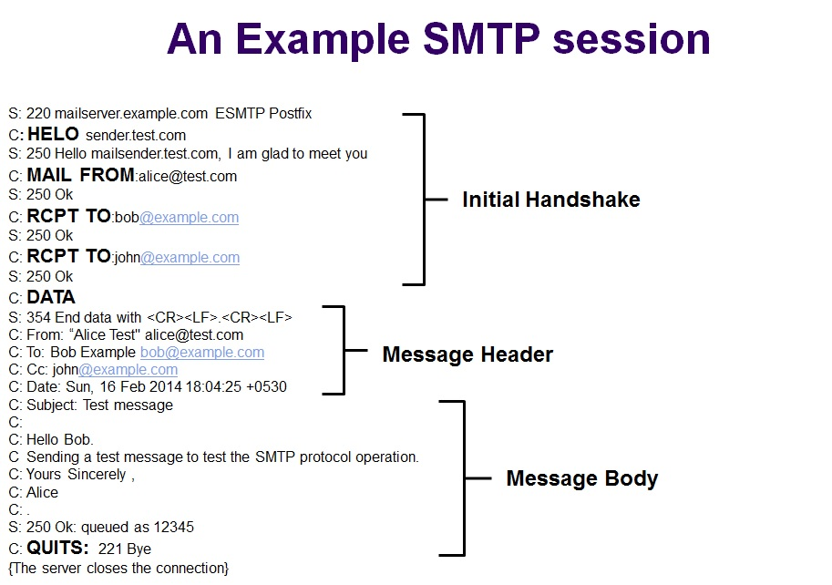{height=50%}


# Web servers

{height=60%}

# Web servers

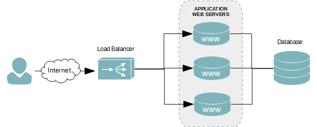{height=60%}

# HTML

* История

    <https://www.w3.org/People/Raggett/book4/ch02.html>

* Въведение

    <https://www.w3schools.com/html/>

* Пример

    <http://www.columbia.edu/~fdc/sample.html>

* Forms

    <https://www.w3schools.com/html/html_forms.asp>

# CSS

* Въведение

    <https://www.w3schools.com/css/default.asp>

* Mozilla

    <https://developer.mozilla.org/en-US/>

# Javascript

* Въведение

    <https://www.w3schools.com/js/default.asp>

* DOM

    <https://www.w3schools.com/js/js_htmldom.asp>

* AJAX

    <https://www.w3schools.com/js/js_ajax_intro.asp>

* Днешните браузъри са сложни

    <https://www.html5rocks.com/en/tutorials/internals/howbrowserswork/>


# HTTP

\


# HTTP

\


# HTTP

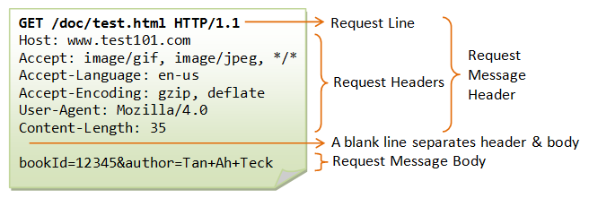\


# HTTP

\


# HTTP

```
$ telnet google.com 80
Trying 216.58.209.14...
Connected to google.com.
Escape character is '^]'.
GET /
```


# HTTP

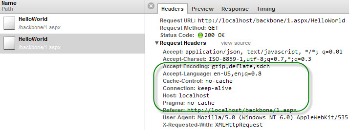


# HTTP


# HTTP


# HTTP

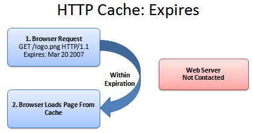


# HTTP

* <https://developer.mozilla.org/en-US/docs/Web/HTTP/Overview>

* <https://www.httpwatch.com/httpgallery/introduction/>


# Databases

* ACID, transactions

* PostgreSQL, MySQL, SQL Server, Oracle

* SQL

* <https://www.w3schools.com/sql/sql_intro.asp>

* SQLite examples

