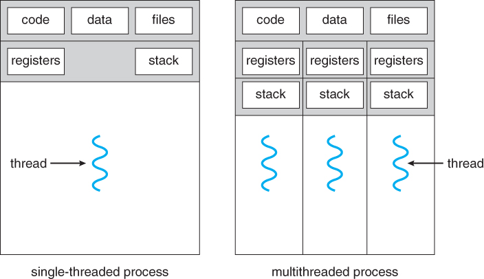
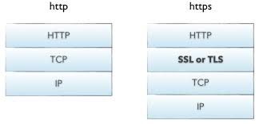

---
title:
- Въведение в програмирането с Python
author:
- Евгени Пандурски (<epandurski@gmail.com>)
theme:
- Copenhagen
---

# За какво е този курс?

1. Въведение
2. Програмиране
3. Python

# Въведение


# Какво е програмиране?
{height=45%}\

Проблем: Управлението на сложни процеси е трудна и отговорна работа.

* изчислителни процеси
* бизнес процеси
* производствени процеси

# Какво е програмиране?
{height=60%}\

Решение: Програмирането е автоматизирано управление на процеси.

# Какво е програма?

{height=60%}

# Какво е програма?
{height=30%}\

Компютърът "се държи" като много ограничен човек, който може да прави
само пет неща:

* може безпогрешно да следва инструкци
* може да смята бързо
* може да помни много
* може да говори бързо
* може да ви разбере дори и да му говорите много бързо

но иначе, не може дори да си обърше носа!

# Как работи компютърът?
{height=60%}

# Как работи компютърът?
{height=55%}

# Как работи компютърът?
{height=60%}

# Как работи компютърът?
{height=55%}

# Какво е компютърна програма?

* Компютърната програма е много подробна рецепта за процесора -- как
  да "мести" числа от едно място в паметта на друго.

* Всички периферни устройства (графична карта, монитор, USB контролер,
  принтер, дисков контролер, диск, мрежова карта и т.н.) четат от I/O
  паметта си какво процесорът им е казал да правят, и го правят.

* Паметта е единственият "свят" който процесорът вижда. В паметта се
  съхраняват данни и програми. За да "види" нещо процесорът, трябва да
  го заредите в паметта му.

* За да изпълни процесорът дадена програма, трябва да я заредите в
  паметта му и да му наредите да започне да я изпълнява.

# Какво е компютърна програма?

{height=60%}

# Какво е компютърна програма?

Проблем:

* За да може процесорът да изпълни каквато и да било програма, тя
  трябва да бъде заредена в паметта като последователност нули и
  единици (двоичен код).

* За хората двоичният код е неразбираем.

# Какво е компютърна програма?

Решение:

* Програмистите могат да пишат програмите си на езици които са
  по-разбираеми за хората, след което тези програми се превеждат в
  двоичен код.
  
* Преводът се извършва от специализирани, много сложни програми,
  наречени "транслатори", "компилатори" или "интерпретатори".

# Какво е компютърна програма?

{height=60%}

# Какво е компютърна програма?

{height=60%}

# Какво е компютърна програма?

{height=60%}

# Python

Python е много популярен, съвременен, интерпретируем, интерактивен,
обектно-ориентиран език за програмиране.

* Създаден е от Гуидо ван Росум през 1990 г. Името си дължи на шоуто
  "Monty Python's Flying Circus", на което авторът на езика е
  почитател.
* Версия 2.0 излиза през 2000 г. Финалната версия на "Python 2" е 2.7.
* Версия 3.0 излиза през 2009 г.

Други популярни интерпретируеми (скриптови) езици:

* Javascript
* Ruby
* Shell scripts (bash, PowerShell)

# Python

## Предимства:

* лесен за научаване
* популярен
* програмите често са по-къси и по-разбираеми
* работи на всякакви компютри и операционни системи
* open source
* огромно количество свободни за ползване библиотеки
* голямо "community" от много високо квалифицирани програмисти, които
  са готови да ви помогнат

## Недостатъци:

* недостатъчно "бърз" за някои видове приложения

# Python

## Къде бихте го ползвали:

* web сървъри
* графичен потребителски интерфейс (GUI)
* числено и статистическо програмиране
* machine learning
* shell скриптове
* игри
* компютърно обучение
* програмиране за удоволствие

## Къде не бихте го ползвали:

* писане на ядро на операциона система
* микроконтролери с много малко оперативна памет

# Python

1. epandurski@gmail.com

2. <https://python.org/>

3. <http://thonny.org/>

4. <https://github.com/epandurski/python-course>

    * exercises.pdf
    * tutorial.pdf 
    * tutorial_BG_2.0.pdf


# Какво трябва да знаем за операционните системи?

{height=50%}


# Какво трябва да знаем за операционните системи?

{height=50%}


# Какво трябва да знаем за операционните системи?

{height=50%}


# Какво трябва да знаем за операционните системи?

{height=50%}


# Какво трябва да знаем за операционните системи?

{height=50%}


# Какво трябва да знаем за операционните системи?

{height=50%}


# Какво трябва да знаем за операционните системи?

{height=50%}


# PyGame

* Библиотека за писане на 2D игри на Питон

* <http://www.pygame.org/>

* Използва библиотеката SDL <http://www.libsdl.org/>

* Hardware Accelerated Graphics

    - framebuffer
    - drawing, "bit blit"

* Graphical User Interface (GUI)

    - windowing system
    - compositing
    - spirtes
    - event loop

* Примери

    - pdb
    - pudb


# Мрежови протоколи

{height=50%}


# Мрежови протоколи

{height=50%}


# Мрежови протоколи

{height=50%}


# Мрежови протоколи

{height=50%}


# Мрежови протоколи

{height=50%}


# Мрежови протоколи

TCP ни гарантира:

1. че това което изпращаме, ако бъде прието, ще бъде прието без
   грешки, в реда в който сме го изпратили;

2. че изпращащият компютър няма да подава информацията по-бързо
   отколкото приемащият компютър може да я обработва.

3. Можем да отвяряме много конекции към/от един и същ IP
   адрес. Различните конекции имат различен "порт".


# Мрежови протоколи

В Питон, стандарният модул `socket` ни позволява да отваряме и
затваряме TCP и UDP конекции, както и да изпращаме и получаваме
инфорамция по тях.

* <https://docs.python.org/3/howto/sockets.html>
* Труден за ползване.
* Формата в който се изпращат и получават съобщенията е отговорност на
  програмиста.
* Криптирането е отговорност на прогамиста.


# Мрежови протоколи

{height=50%}


# Мрежови протоколи

{height=50%}


# Мрежови протоколи

{height=60%}


# Мрежови протоколи




# Мрежови протоколи

Стандартната библиотека на Питон включва модули за работа с всички
основни интернет протоколи.

* DNS -- `socket.gethostbyname('google.com')`
* [smtplib](https://docs.python.org/3/library/smtplib.html)
* [smtpd](https://docs.python.org/3/library/smtpd.html)
* [email](https://docs.python.org/3/library/email.html)
* [http](https://docs.python.org/3/library/http.html)
* [ssl](https://docs.python.org/3/library/ssl.html)
* [urllib](https://docs.python.org/3/library/urllib.html)
* [ipaddresses](https://docs.python.org/3/library/ipaddress.html)
* [ftplib](https://docs.python.org/3/library/ftplib.html)


# The World Wide Web (WWW)

{height=55%}


# The World Wide Web (WWW)

{height=55%}


# HTML

> Hypertext Markup Language (HTML) is the standard markup language for
> creating web pages and web applications. With Cascading Style Sheets
> (CSS) and JavaScript, it forms a triad of cornerstone technologies
> for the World Wide Web.

* [История](<https://www.w3.org/People/Raggett/book4/ch02.html>)

* Въведение и примери

    <http://www.columbia.edu/~fdc/sample.html>
    <https://www.w3schools.com/html/default.asp>
    <https://www.w3schools.com/html/html_forms.asp>

* [Mozilla Developer Network (MDN)](https://developer.mozilla.org/en-US/)


# CSS

> Cascading Style Sheets (CSS) is a style sheet language used for
> describing the presentation of a document written in a markup
> language like HTML. CSS is a cornerstone technology of the World
> Wide Web, alongside HTML and JavaScript.

* Въведение и примери

    <https://www.w3schools.com/css/default.asp>


# Javascript

> JavaScript is a high-level, interpreted programming
> language. Alongside HTML and CSS, JavaScript is one of the three
> core technologies of the World Wide Web. JavaScript enables
> interactive web pages and thus is an essential part of web
> applications. The vast majority of websites use it, and all major
> web browsers have a dedicated JavaScript engine to execute it.

* Въведение и примери

    <https://www.w3schools.com/js/default.asp>
    <https://www.w3schools.com/js/js_htmldom.asp>

* [Днешните браузъри са
  сложни](https://www.html5rocks.com/en/tutorials/internals/howbrowserswork/)
    
* [Single Page Applications](https://en.wikipedia.org/wiki/Single-page_application)


# HTTP

\


# HTTP Request

\


# HTTP Response

\


# HTTP Example

```
$ telnet google.com 80
Trying 216.58.209.14...
Connected to google.com.
Escape character is '^]'.
GET /
```

```
$ python3 -m http.server
```


# Какво ни дава HTTP?


# Какво ни дава HTTP?


# Какво ни дава HTTP?


# Какво ни дава HTTP?


# Какво ни дава HTTP?

* <https://www.httpwatch.com/httpgallery/introduction/>

* <https://developer.mozilla.org/en-US/docs/Web/HTTP/Overview>


# Databases


# Databases

> A database is an ORGANIZED collection of data, stored and accessed
> electronically.

* hierarchical databases
* key-value stores
* object databases
* document databases
* graph databases
* relational databases (the most flexible, the most complex)


# Databases

* [Database theory](https://en.wikipedia.org/wiki/Database_theory)

* [ACID](https://en.wikipedia.org/wiki/ACID)

    - atomicity
    - consistency
    - isolation
    - durability


# Databases

* [Non-relational (NoSQL) databases: redis,
  MongoDB](https://en.wikipedia.org/wiki/NoSQL)

    - excellent scalability
    - non-ACID

* [Relational databases: PostgreSQL, MariaDB/MySQL, SQL Server,
  Oracle](https://en.wikipedia.org/wiki/Relational_model)

    - tables (relations), schema
    - structured query language
    - transactions, write ahead log, memory buffers
    - concurrency, locking, multi-version concurrency control
    - backup, replication
    - scaling, tablespaces, sharding
    - indexes, full text search
    - stored procedures, triggers, views


# Databases

* [SQL](https://en.wikipedia.org/wiki/SQL)

    <https://www.w3schools.com/sql/sql_intro.asp>

* [SQLite examples](https://www.sqlite.org/index.html)

    - database client
    - database schema
    - primary key
    - foreign key
    - one-to-one, one-to-many, many-to-many relationships
    - queries
    - insert, update, delete
    - database constraints
    - joins
    - indexes, execution plan
    - transaction isolation

* [Object Relational Mappers](https://docs.djangoproject.com/en/2.0/topics/db/queries/)


# Django

> Django is a high-level Python Web framework that encourages rapid
> development and clean, pragmatic design. Built by experienced
> developers, it takes care of much of the hassle of Web development,
> so you can focus on writing your app without needing to reinvent the
> wheel. It’s free and open source.

* <https://docs.djangoproject.com/en/2.0/intro/tutorial01/>


# Алгоритми

Ако имаме два алгоритъма за решаване на една задача, как решаваме кой
от тях е по-добър?

  * време за изпълнение
  * използвана памет
  * може би на практика няма значение?
  * зависи ли от входните данни?


# Алгоритми

## Пример 1а: Намерете сумата на числата от 1 до n.

```python
def calc_sum_up_to(n):
    s = 0
    for x in range(1, n + 1):
        s += x
    return s
```

## Time complexity:

`O(n)`

## Space complexity:

`O(1)`


# Алгоритми

## Пример 1б: Намерете сумата на числата от 1 до n.

```python
def calc_sum_up_to(n):
    return n * (n + 1) / 2
```

## Time complexity:

`O(1)`

## Space complexity:

`O(1)`


# Алгоритми

## Пример 2а: Определете дали дадено число `x` се съдържа в подреденият списък от числа `SORTED_LIST`.

```python
def occurs_in_list(x):
    for element in SORTED_LIST:
        if x == element:
            return True
    return False
```

## Time complexity (n = len(SORTED_LIST)):

* Best case: 1  изпълнение на тялото на цикъла
* Worst case: `n` изпълнения на тялото на цикъла
* Average case: неизвестно, зависи от честотата на поява на различните
  възможни стойности за `x`

`O(n)`


# Алгоритми

## Пример 2б: Определете дали дадено число `x` се съдържа в подреденият списък от числа `SORTED_LIST`.

```python
def occurs_in_list(x, arr=SORTED_LIST):
    if len(arr) == 0:
        return False
    center = len(arr) // 2
    center_value = arr[center]
    if x == center_value:
        return True
    if x > center_value:
        return occurs_in_list(x, arr[center + 1:])
    if x < center_value:
        return occurs_in_list(x, arr[:center])
```


# Алгоритми

## Пример 2б:

Често определянето на това колко пъти ще се изпълни даден цикъл не
проста задача и изисква по-задълбочен анализ.  В този случай
обикновено се изследва т.н. асимптотично поведение.

## Time complexity:

`O(log(n))`

## Space complexity:

`O(n)`


# Алгоритми

## Пример 2в: Определете дали дадено число `x` се съдържа в подреденият списък от числа `SORTED_LIST`.

```python
def occurs_in_list(x, left=0, right=len(SORTED_LIST)):
    if left == right:
        return False
    center = (left + right) // 2
    center_value = SORTED_LIST[center]
    if x == center_value:
        return True
    if x > center_value:
        return occurs_in_list(x, center + 1, right)
    if x < center_value:
        return occurs_in_list(x, left, center)
```

## Space complexity:

`O(log(n))`


# Алгоритми

## Пример 3: Sorting

* [Bubble sort](https://www.studytonight.com/data-structures/bubble-sort) -- O(n**2)
* [Selection sort](https://www.studytonight.com/data-structures/selection-sorting) -- O(n**2)
* [Insertion sort](https://www.studytonight.com/data-structures/insertion-sorting) -- O(n**2), stable, adaptive
* [Merge sort](https://www.studytonight.com/data-structures/merge-sort) -- O(n * log(n)), stable
* [Quick sort](https://www.studytonight.com/data-structures/quick-sort) -- O(n * log(n))
* [Heap sort](https://www.studytonight.com/data-structures/heap-sort) -- O(n * log(n)), in-place
* [Timsort](https://en.wikipedia.org/wiki/Timsort) -- O(n * log(n)), stable, almost in-place, adaptive


# Алгоритми

## Merge Sort

```python
def mergesort(arr, left=0, right=None):
    if right is None:
        right = len(arr) - 1
    if left < right:
        center = (left + right) // 2
        mergesort(arr, left, center)
        mergesort(arr, center + 1, right)
        merge(arr, left, center, right)
```


# Алгоритми

## Merge Sort

```python
def merge(arr, left, center, right):
    n_left, n_right = center - left + 1, right - center
    L = [arr[left + i] for i in range(n_left)]
    R = [arr[center + 1 + j] for j in range(n_right)]
    i, j, k = 0, 0, left  # initial indexes
    while i < n_left and j < n_right:
        if L[i] <= R[j]:
            arr[k] = L[i]; i += 1
        else:
            arr[k] = R[j]; j += 1
        k += 1
    while i < n_left:
        arr[k] = L[i]; i += 1; k += 1
    while j < n_right:
        arr[k] = R[j]; j += 1; k += 1
```


# Алгоритми

## Как да пишем алгоритми които работят достатъчно бързо:

* Не извършвайте една операция повече пъти отколкото е
  необходимо. Най-добре е ако можете да измислите как въобще да не
  извършвате дадената операция. Преценете дали е обосновано да
  запомняте резултата за да може да го използвате в бъдеще наготово
  (caching).

* Изследвайте поведението на алгоритъма в екстремните случаи. Оценете
  колко често ще попадате в тях и доколко това ще предизвиква проблеми
  на практика.

* Не влагайте повече усилия в оптимизация от необходимото. Често
  най-простото решение е достатъчно бързо. Преди да започнете да
  усложнявате кода си за да го направите по-бърз, уверете се че
  причината за забавянето е наистина тази която си мислите. Направете
  измервания.


# Структури от данни

> In computer science, a data structure is a data organization and
> storage format that enables efficient access and modification. More
> precisely, a data structure is a collection of data values, the
> relationships among them, and the functions or operations that can
> be applied to the data.

## Intro

* <https://medium.com/swlh/introduction-to-data-structures-9134b7d064a6>
* dict (hash map)
* list (dynamically sized vector)
* deque
* heapq
